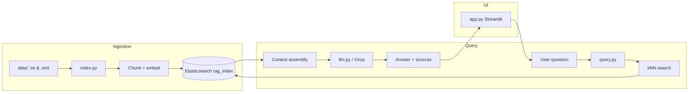

# Support Insights

An enterprise **Retrieval-Augmented Generation (RAG)** assistant for support teams. Upload historical **`.txt`** notes and **`.eml`** email threads, then ask natural-language questions about past incidents, resolutions, and ownership. Answers are grounded in retrieved passages and cite their sources.

Built with **Elasticsearch dense vector search**, **sentence-transformers** embeddings, **Groq** (Llama) for generation, and a **Streamlit** chat UI.

---

## Features

- **Document ingestion** — Index plain-text files and email archives (`.txt`, `.eml`) with metadata (subject, sender).
- **Semantic search** — Chunk-level kNN over 384-dimensional embeddings (`all-MiniLM-L6-v2`).
- **Smart context assembly** — Parent-aware retrieval reunites split email threads; neighbor expansion pulls adjacent chunks when no single document dominates.
- **Overlapping chunks** — ~500-character windows with ~100-character overlap and soft breaks at paragraph/sentence boundaries.
- **Source attribution** — Every answer lists source files and exposes retrieved chunks in the UI.
- **Streamlit admin** — Upload documents, re-index, and clear conversation from the sidebar.

---

## Architecture



**Pipeline overview**

1. **Index** — Documents are split into overlapping chunks, embedded, and stored in Elasticsearch with parent metadata (`parent_id`, `full_text`, chunk indices).
2. **Retrieve** — The user question is embedded; top-k chunks are fetched via cosine kNN.
3. **Assemble context** — If a strict majority of hits share the same parent, a bounded full-document window is promoted. Otherwise, previous/current/next neighbors are merged under a character budget.
4. **Generate** — Groq (OpenAI-compatible API) produces a support-oriented answer using only the assembled context.

---

## Tech stack

| Layer | Technology |
|-------|------------|
| Vector store | Elasticsearch 8.x (`dense_vector`, cosine similarity) |
| Embeddings | `sentence-transformers` — `all-MiniLM-L6-v2` (384 dims) |
| LLM | Groq — `llama-3.1-8b-instant` (configurable) |
| Frontend | Streamlit |
| Language | Python 3.10+ |

---

## Project structure

```
rag-project/
├── app.py                  # Streamlit chat UI
├── rag.py                  # RAG orchestration (retrieve → context → LLM)
├── index.py                # Document loading, chunking, Elasticsearch indexing
├── query.py                # kNN retrieval and context assembly
├── llm.py                  # Groq client and prompt
├── requirements.txt
├── .env.example            # Environment variable template
├── data/                   # Local knowledge base (gitignored)
└── utils/
    ├── chunking.py         # Overlapping text segmentation
    ├── helpers.py          # Embedding model wrapper
    └── retrieval_context.py # Parent-aware & neighbor expansion logic
```

---

## Prerequisites

- **Python 3.10+**
- **Elasticsearch 8.x** running locally (default: `http://localhost:9200`)
- **Groq API key** — [console.groq.com](https://console.groq.com/)

### Start Elasticsearch (Docker)

```bash
docker run -d --name elasticsearch \
  -p 9200:9200 -p 9300:9300 \
  -e "discovery.type=single-node" \
  -e "xpack.security.enabled=false" \
  docker.elastic.co/elasticsearch/elasticsearch:8.12.1
```

---

## Installation

```bash
git clone <your-repo-url>
cd rag-project

python -m venv rag_env

# Windows (PowerShell)
.\rag_env\Scripts\Activate.ps1

# macOS / Linux
source rag_env/bin/activate

pip install -r requirements.txt
```

---

## Configuration

Copy the example env file and add your credentials:

```bash
cp .env.example .env
```

| Variable | Description | Default |
|----------|-------------|---------|
| `GROQ_API_KEY` | Groq API key (**required**) | — |
| `GROQ_MODEL` | Chat model name | `llama-3.1-8b-instant` |
| `ELASTICSEARCH_URL` | Elasticsearch endpoint | `http://localhost:9200` |

> **Never commit `.env`.** It is listed in `.gitignore`. Use `.env.example` as the template for collaborators.

---

## Usage

### 1. Add documents

Place `.txt` or `.eml` files in the `data/` folder, or upload them through the Streamlit sidebar.

### 2. Build the index

```bash
python index.py
```

This recreates the `rag_index` index and embeds all files under `data/`.

### 3. Run the web app

```bash
streamlit run app.py
```

Open the URL shown in the terminal (typically `http://localhost:8501`).

### 4. CLI (optional)

Ask a single question from the terminal:

```bash
python rag.py
```

---

## Retrieval strategies

After kNN returns the top chunks, `query.py` chooses how to build LLM context:

| Strategy | When | Behavior |
|----------|------|----------|
| `full_document` | Strict majority of hits share one `parent_id` | Promotes a window around the best-matching span from the full parent body (max ~10k chars). |
| `neighbor_expansion` | No dominant parent | Fetches previous, current, and next chunk for each hit; deduplicates and applies a character budget. |
| `chunks_only` | Fallback | Uses raw kNN chunk blocks only. |

The active strategy is shown in the Streamlit UI under each answer.

---

## Chunking defaults

| Parameter | Value |
|-----------|-------|
| Chunk size | ~500 characters |
| Overlap | ~100 characters |
| Soft breaks | Paragraph → newline → sentence punctuation |

Overlap ensures facts that straddle chunk boundaries remain retrievable. See `utils/chunking.py` for implementation details.

---

## Troubleshooting

| Issue | Fix |
|-------|-----|
| `streamlit` not found | Activate the virtual environment first, or run `python -m streamlit run app.py` |
| `GROQ_API_KEY is not set` | Create `.env` from `.env.example` and set your key |
| Search index not found | Run `python index.py` after adding files to `data/` |
| Could not reach Elasticsearch | Confirm Elasticsearch is running at the configured URL |

---

## Security notes

- Store API keys in `.env` only; rotate any key that was ever committed to source control.
- The `data/` folder is gitignored — email archives often contain PII and internal details.
- Use a **private** GitHub repository if deploying with real support data.

---

## License

MIT (or specify your license here)
